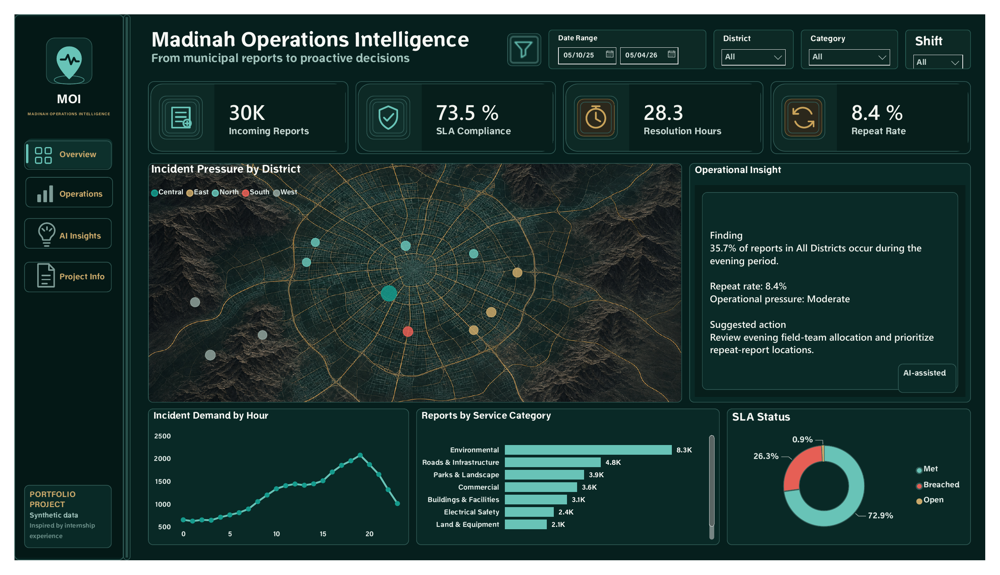
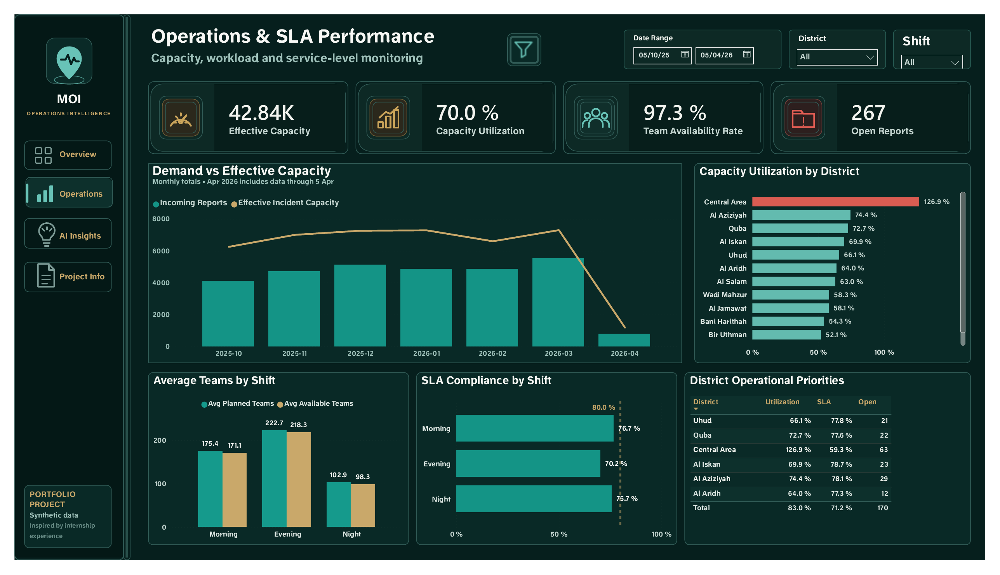
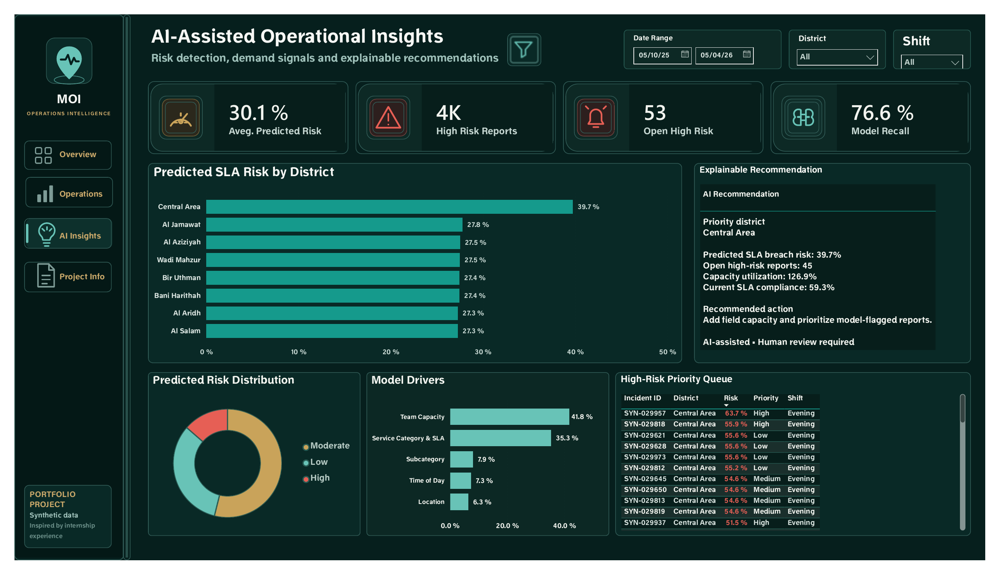
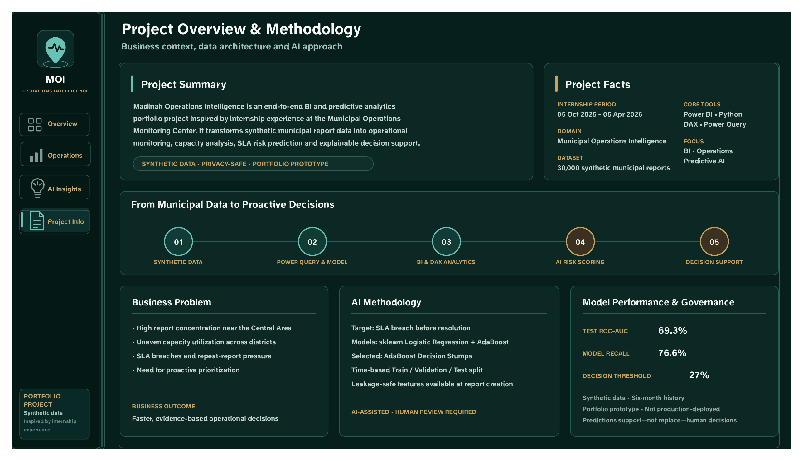

# Madinah Operations Intelligence

**Business Intelligence · Operations Analytics · Responsible Predictive Analytics**

An end-to-end portfolio case study inspired by my internship experience at the Municipal Operations Monitoring Center in Madinah. The solution transforms **30,000 privacy-safe synthetic reports** into operational monitoring, capacity analysis, SLA-risk prioritization, and explainable decision support.

> **Project scope:** Independent portfolio prototype using synthetic data. It is not an official Municipality product and has not been production-deployed.



## Recruiter snapshot

- **Business need:** Give operations teams a clear view of demand, field capacity, SLA performance, and priority reports.
- **My contribution:** Data preparation, dimensional modeling, DAX measures, dashboard design, predictive modeling, validation, documentation, and responsible-use controls.
- **Tools:** Power BI, Power Query, DAX, Python, pandas, NumPy, and scikit-learn.
- **Deliverables:** Four-page dashboard, documented measures, model-training code, model metrics, feature importance, model card, and synthetic fact/dimension tables.

## Business questions

The project explores:

- Where are incoming reports concentrated?
- Does operational capacity match demand across districts and shifts?
- Which service-level risks require attention?
- Which open reports should be reviewed first?
- How can predictive insight support—not replace—operational judgment?

## Solution

The Power BI report contains four connected pages:

1. **Overview** — Executive KPIs, district pressure, hourly demand, service categories, SLA status, and an operational finding.
2. **Operations** — Demand versus effective capacity, utilization, team availability, shift-level SLA performance, and operational priorities.
3. **AI Insights** — Predicted SLA-breach risk, risk distribution, model drivers, recommendation logic, and a high-risk review queue.
4. **Project Info** — Business context, architecture, methodology, model performance, limitations, and governance.

## Predictive methodology

- **Target:** SLA breach before report resolution.
- **Models evaluated:** scikit-learn Logistic Regression and AdaBoost decision stumps.
- **Preprocessing:** A fitted `ColumnTransformer` performs numeric imputation and scaling plus categorical imputation and one-hot encoding.
- **Model packaging:** Each classifier is evaluated inside a reproducible scikit-learn `Pipeline`; the selected fitted pipeline is exported with `joblib`.
- **Selected model:** AdaBoost decision stumps, chosen by validation ROC-AUC.
- **Validation design:** Time-based train, validation, and test split.
- **Leakage control:** Features are limited to information available at or shortly after report creation.
- **Test ROC-AUC:** 69.3%.
- **Recall:** 76.6%.
- **Review threshold:** 27%.

The predictions are designed to support prioritization and require human review.

## Technology

- Power BI Desktop
- Power Query
- DAX
- Python
- pandas, NumPy, scikit-learn, and joblib
- Synthetic data generation
- Data-quality validation

## Repository structure

```text
dashboard/       Power BI report
screenshots/     Exported dashboard pages
data/            Synthetic fact and dimension tables
ai-model/        Training code, metrics, feature importance, and model card
dax/             Power BI measures
documentation/   Dashboard PDF
```

## Run the model

From the repository root:

```bash
python -m pip install -r requirements.txt
python ai-model/train_sla_risk_model.py
```

The script reads the synthetic fact and dimension tables and exports the fitted preprocessing-and-model pipeline, model metrics, feature importance, district summaries, and incident-level risk predictions. Model selection and threshold tuning use the validation period only; the test period remains reserved for final evaluation.

## Dashboard previews

### Operations and SLA performance



### AI-assisted operational insights



### Methodology and governance



## Responsible use

- All records are synthetic and privacy-safe.
- The model is a portfolio prototype, not a production service.
- Recommendations require human review.
- Performance and limitations are disclosed in the model card.
- Predictive outputs should not be used as the sole basis for operational decisions.

## Author

**Yomna Alhejaili**  
Junior Data & Business Intelligence Analyst  
Power BI · SQL · Python · Reporting · Performance · Operations Analytics

- [LinkedIn](https://www.linkedin.com/in/yomna-alhejaili-0b3991216)
- [GitHub](https://github.com/youmnaeidh)
